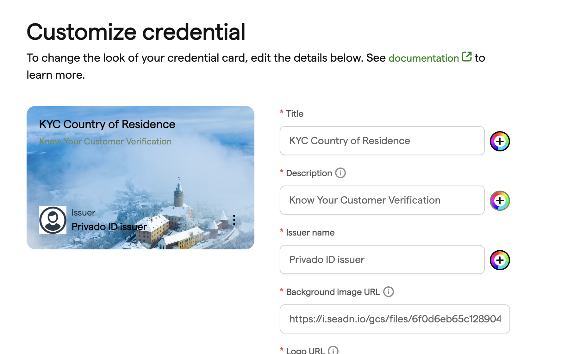
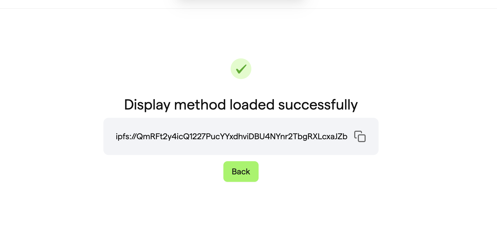
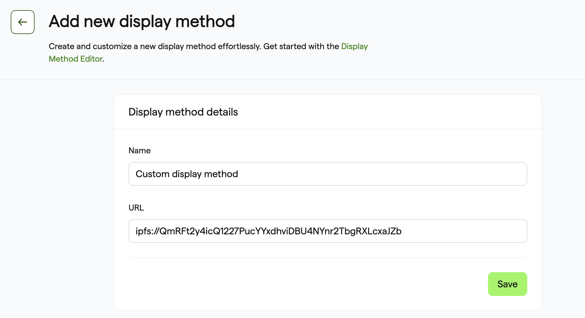
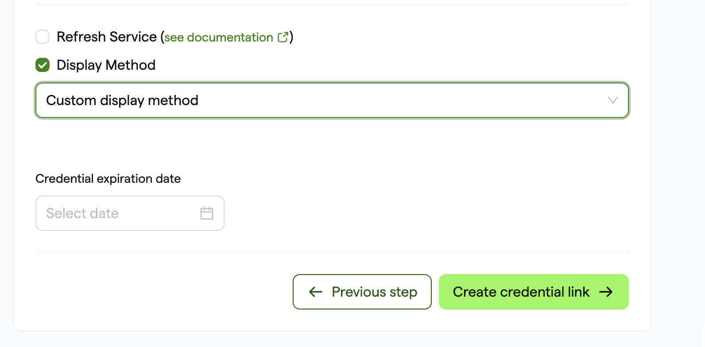
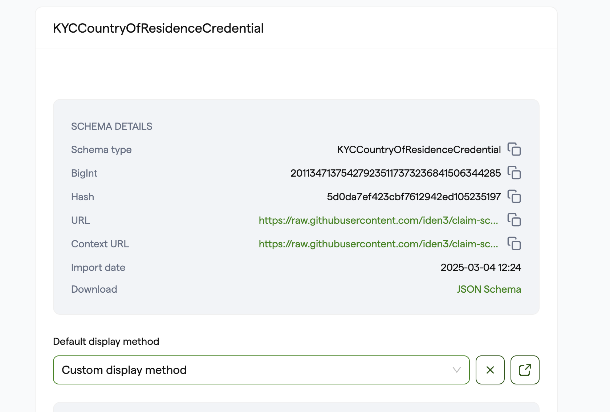
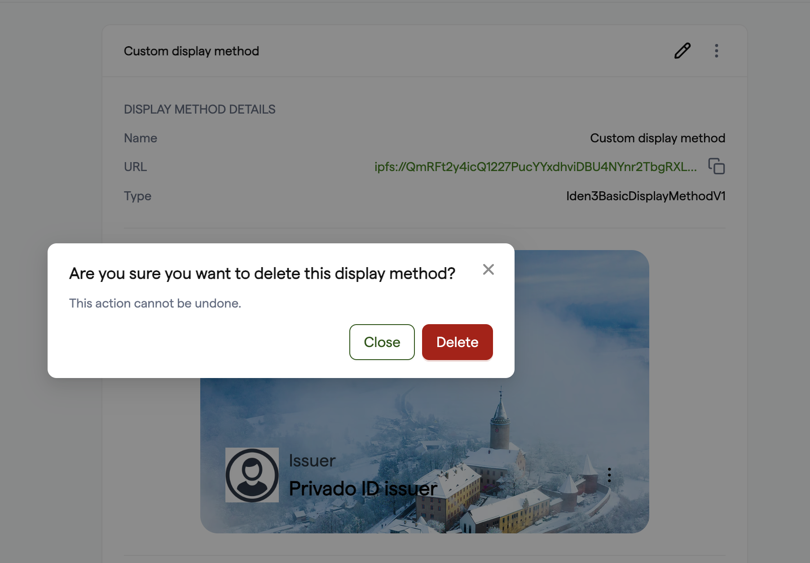

## Overview

Custom Display Methods define the visual presentation and branding of verifiable credentials issued through the Privado Issuer Node. They enable organizations to create professional, branded credentials that maintain consistency across all issued documents while building trust with credential holders.

### Key Benefits

- **Brand Consistency**: Ensure all credentials follow your organization's visual identity
- **Professional Appearance**: Create visually appealing credentials that enhance credibility
- **Customization**: Tailor the look and feel to match specific use cases or credential types
- **User Trust**: Professional presentation increases confidence in credential authenticity
- **Reusability**: Create once and apply to multiple credential schemas

---

## Custom Display Methods

**What are Custom Display Methods?**  
They define how a credential is presented to its holder. For instance, a university may issue digital diplomas in a specific layout (with the university’s logo, official colors, etc.) that is visually appealing. A Custom Display Method ensures consistency and brand adherence across all issued credentials.

### Example: KYC Age Verification Display Method

**Assets Required:**
- Issuer logo (64x64px PNG)
- KYC background (320x200px JPEG)
- Brand colors from Issuer guidelines

**metadata.json:**
```json
{
  "title": "KYC Age Credential",
  "description": "Know Your Customer Verification",
  "issuerName": "PrivadoID Issuer",
  "titleTextColor": "#f2743a",
  "descriptionTextColor": "#f2743a",
  "issuerTextColor": "#f2743a",
  "backgroundImageUrl": "ipfs://QmecKDMotkM8a6vxw35CB7iHfToBJnzJrPcmA3gHit9jt9",
  "logo": {
    "uri": "ipfs://QmWkSgmHbKRfhndWqHwVgfVpZSrWNiWZMTHb6k5KxY8ySc",
    "alt": "Logo PrivadoID Issuer"
  }
}
```

**Credential Issuance:**
```json
{
  "credentialSchema": "https://raw.githubusercontent.com/iden3/claim-schema-vocab/main/schemas/json/KYCAgeCredential-v3.json",
  "type": "KYCAgeCredential",
  "credentialSubject": {
    "id": "<USER_DID>",
    "birthday": 19960424,
    "documentType": 2
  },
  "expiration": 1735689600,
  "displayMethod": {
    "id": "<IPFS_LINK_OR_HTTP_URL_TO_METADATA_FILE>",
    "type": "Iden3BasicDisplayMethodV1"
  }
}
```
---

## Building a Display Method

Restrictions:

1. `backgroundImageUrl` and `logo` only support .png and .jpeg formats.
2. Maximum length for `title` is 60 characters.
3. Maximum length for `description` is 120 characters.

### Step 1: Fill Out Metadata
1. Open the [Display Method Builder](https://display-method-dev.privado.id/).
2. Enter all required metadata fields (tile, description, issuer name, etc.)
3. Make sure to follow any restrictions or formatting requirements.



### Step 2: Publish to IPFS
1. After filling out the metadata, click on “**Publish to IPFS**”.
2. The Builder will bundle and publish your Display Method JSON to IPFS.

### Step 3: Obtain the IPFS Link
1. Wait for the publishing response.
2. Copy the IPFS link provided (e.g., `ipfs://...` or `https://ipfs.io/ipfs/...`).
3. This link uniquely references your Display Method and will be used in the Issuer Node.



---

## Usage of a Display Method in Issuer Node

### Adding the Display Method to the Issuer Node
1. In your Issuer Node, navigate to the **Display Method** section (go to `/display-methods/create` or click **Create a Display Method**).
2. Fill out the form:
   - Provide a **unique name** for the Display Method (e.g., `KYC Age Display Method` or `Employee Achievement Method`).
   
   - Paste the **IPFS URL** from the previous step into the `URL` field.

   

3. Save your changes. The Display Method is now registered with your Issuer Node.

### Using a Display Method When Issuing Credentials
1. In the **Issue Credential** flow, enable the **Display Method** checkbox.
2. Select your newly created method from the dropdown list.
3. Once you issue the credential, it will reference your custom Display Method.



### Setting a Default Display Method for a Schema
1. On the **Schema Details** page in the Issuer Node, find the **Display Method** selector.
2. Choose a default method for that schema.
3. Any credential issued under this schema will automatically use the default Display Method (unless manually overridden).



---

## Editing or Deleting a Display Method
To edit or delete a Display Method, go to:
- The detail page of the Display Method, or
- The list of all Display Methods.

Locate the **edit** or **delete** icons to make changes accordingly.



---

## API References

Below is a summary of the relevant API endpoints to manage Display Methods and schemas:

### New APIs Added in the Issuer Node
- [**Create Custom Display Method**](https://issuer-node-core-api-testing.privado.id/#post-/v2/identities/-identifier-/display-method) 
- [**Delete Display Method**](https://issuer-node-core-api-testing.privado.id/#delete-/v2/identities/-identifier-/display-method/-id-)
- [**Get All Display Methods**](https://issuer-node-core-api-testing.privado.id/#get-/v2/identities/-identifier-/display-method)
- [**Get Display Method**](https://issuer-node-core-api-testing.privado.id/#get-/v2/identities/-identifier-/display-method/-id-)
- [**Update Display Method**](https://issuer-node-core-api-testing.privado.id/#patch-/v2/identities/-identifier-/display-method/-id-)
- [**Update Schema**](https://issuer-node-core-api-testing.privado.id/#patch-/v2/identities/-identifier-/schemas/-id-)

### Updated APIs in the Issuer Node
- [**Get Schemas**](https://issuer-node-core-api-testing.privado.id/#get-/v2/identities/-identifier-/schemas) 
  - Now returns a `displayMethodID` in the schema response.
- [**Get Schema**](https://issuer-node-core-api-testing.privado.id/#get-/v2/identities/-identifier-/schemas/-id-)
  - Now returns a `displayMethodID` in the schema response.

---

## Links

1. [Display Method Info](https://iden3-communication.io/w3c/display-method/overview)
2. [Display Method Builder](https://display-method-dev.privado.id/)


## Conclusion

Custom Display Methods provide a powerful way to enhance the presentation and branding of verifiable credentials. By following the guidelines and best practices outlined in this documentation, organizations can create professional, trustworthy credentials that serve their users effectively while maintaining brand consistency and technical excellence.

The combination of flexible design capabilities, robust technical architecture, and comprehensive management tools makes Display Methods an essential component of any professional credential issuance system. Whether you're issuing educational certificates, professional licenses, or corporate credentials, Display Methods ensure your credentials make the right impression while maintaining the highest standards of security and usability.