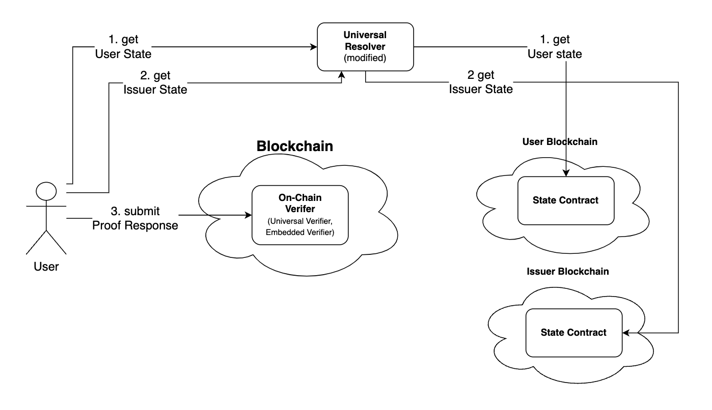

## ZK Airdrop: A Secure Cross-Chain Token Distribution Tutorial

In decentralized finance and other blockchain-based applications, airdrops are a popular method to distribute tokens. However, ensuring that only eligible users participate in the airdrop is crucial for maintaining the integrity and security of the process. Cross-chain verification using zero-knowledge (ZK) proofs offers a scalable and secure solution. This tutorial will guide you through implementing a secure airdrop using cross-chain verification, ensuring only users who meet specific criteria can claim tokens.

### Challenges with Traditional On-Chain Verification:

- **Limited Scope**: Traditional on-chain verification methods typically require that all involved components such as user credentials, verification logic, and identity data exist on the same blockchain. This limits interoperability and restricts user participation in a single blockchain ecosystem.
- **Fragmented Identity Management**: With the rise of multiple blockchain networks (e.g., Ethereum, Polygon, Binance Smart Chain), users often have identities and credentials spread across different chains. Managing and verifying these identities on separate chains becomes complex and inefficient.
- **Scalability and Flexibility**: As decentralized applications (dApps) scale and operate across multiple chains, they require a verification mechanism that can handle credentials and verification requests from various sources without compromising security or user privacy.

### Benefits of Cross-Chain Verification:

- **Interoperability**: Cross-chain verification allows users to prove their credentials across different blockchains seamlessly. This means a user with credentials on one chain can participate in activities (like airdrops) on another chain without the need to transfer or duplicate their identity data.
- **Scalability**: By enabling verification across multiple chains, applications can scale more efficiently, accommodating users and issuers from diverse blockchain environments. This opens up broader participation and adoption of decentralized services.
- **Streamlined User Experience**: Users can participate in various blockchain-based activities without having to manage multiple identities or credentials. Cross-chain verification provides a unified approach, simplifying the interaction with decentralized services.

## Step-by-Step Implementation

Imagine a scenario where a new "XYZ Protocol" is launching and wants to distribute tokens to users via an airdrop. However, to ensure the quality and compliance of the distribution, XYZ Protocol wants to restrict participation to users who have Proof of Humanity (PoH) Credential to restrict bots from participating in the airdrop. This airdrop will be conducted using cross-chain verification, allowing users from different blockchain networks to participate securely.

### Key Requirements for the Airdrop:

- **PoH Credential Verification**: Users must possess Proof Of Human(PoH) credentials.
- **Cross-Chain Participation**: Users can prove their eligibility from different chains, such as Ethereum, Polygon, etc.
- **Privacy Preservation**: Use zero-knowledge proofs to maintain user privacy while verifying credentials.

### Components Involved:

- **User Chain**: The chain where users hold their identity and credentials.
- **Issuer Chain**: The chain where issuers manage and verify credential validity.
- **Verification Chain**: The chain where the airdrop verification occurs.
- **Universal Verifier**: A smart contract on verification chain that handles the verification of ZK proofs and the issuance of airdrop tokens.

### General Flow of Cross-Chain Verification:

To implement on-chain verification user should collect User and Issuer state data from corresponding chains and submit it to the Universal Verifier smart contract on the verification chain. However, the verifier contract can't check the integrity of the states from other chains. So we need a trusted service to sign the States, which is centralised Universal Resolver at the moment but will be substituted by decentralised signer services in the future.



The general flow of cross-chain verification involves the following steps:

1. **Obtain PoH Verifiable Credential (VC)**: The user obtains a Verifiable Credential proving their Proof of Humanity.
2. **Get Signed User and Issuer State**: The user gets a signed User State (Global State / GIST Root) and Issuer State from a trusted Resolver.
3. **Generate ZK Proof**: The user generates a Zero-Knowledge proof based on their VC and signed User State.
4. **Submit ZK Proof**: The user submits the ZK proof and signed data to the Universal Verifier in the verification chain. The new `submitZKPResponseV2` method is used to submit the proof along with the cross-chain data.
5. **Trigger User Action**: When the user action triggers (e.g., minting tokens), the Logic Smart Contract (here, Airdrop Smart Contract) checks the Universal Verifier Smart Contract for the proof status and issues tokens if the criteria are met.

### Step 1: Setting Up the Query Request

The first step in using XYZ Protocol is to set up an airdrop request that specifies the verification criteria. This criteria can be customized to fit your needs, but for this example, we'll demonstrate how to check if a user has a Proof Of Humanity (PoH) credential and verify their isHuman value.

**NOTE:** Schema URLs used for this tutorial:  
- `"jsonLdContext": "https://ilvcs.github.io/JsonHosting/poh-context.json"`  
- `"jsonSchema": "https://ilvcs.github.io/JsonHosting/poh-json-schema.json"`

For setting up the ZKP request, please visit Set ZKP Request section:

[Set ZKP Request](/docs/verifier/on-chain-verification/set-zkp-request.md)

### Step 2: Creating Secure Airdrop System

#### A. Implementing Airdrop Smart Contract:

Now we need to create an Airdrop smart contract that can check if the user has already presented proofs to the Universal Verifier (and has been verified). If so, mint tokens for the user. 

Create a Hardhat project and ensure you add the Amoy testnet JSON RPC URL and a private key with Amoy tokens. Update the `hardhat.config.js` file accordingly. Then, create the `ZKAirdropVerifier.sol` smart contract in the `contracts` folder using the code provided below. 

```solidity
// SPDX-License-Identifier: MIT
pragma solidity 0.8.20;

import {ERC20} from '@openzeppelin/contracts/token/ERC20/ERC20.sol';
import {PrimitiveTypeUtils} from '@iden3/contracts/lib/PrimitiveTypeUtils.sol';
import {ICircuitValidator} from '@iden3/contracts/interfaces/ICircuitValidator.sol';
import {UniversalVerifier} from '@iden3/contracts/verifiers/UniversalVerifier.sol';

contract ZKAirdropVerifier is ERC20 {
  uint64 public constant REQUEST_ID = 12345; // replace with your own requestID

  UniversalVerifier public verifier;

  uint256 public TOKEN_AMOUNT_FOR_AIRDROP_PER_ID = 5 * 10 ** uint256(decimals());

  mapping(address => bool) public isClaimed;

  modifier beforeTokenTransfer(address to) {
     // only one airdrop per address is allowed
     require(
        !isClaimed[to],
        'only one airdrop per address is allowed'
     );

     require(
        verifier.getProofStatus(to, REQUEST_ID).isVerified ,
        'only identities who provided sig or mtp proof for transfer requests are allowed to receive tokens'
     );
     _;
  }

  constructor(
     UniversalVerifier verifier_,
     string memory name_,
     string memory symbol_
  ) ERC20(name_, symbol_) {
     verifier = verifier_;
  }

  function mint() public {
     
     require(msg.sender == tx.origin, 'only EOA can mint');
     require(msg.sender != address(0), 'invalid address');
     _mint(msg.sender, TOKEN_AMOUNT_FOR_AIRDROP_PER_ID);
     // mark the address as claimed
     isClaimed[msg.sender] = true;
  }

  function _update(
     address from,
     address to,
     uint256 value
  ) internal override beforeTokenTransfer(to) {
     super._update(from, to, value);
  }
}
```

You can see that the smart contract's construction requires the address of the deployed Universal Verifier smart contract.

Make sure to add the request ID used to set the `ZKPRequest` for the `uint64 public constant REQUEST_ID`.

The `beforeTokenTransfer` modifier checks the Universal Verifier smart contract to see if the user has been verified and if they have already claimed the airdrop.

We override the `_update` function to use the `beforeTokenTransfer` modifier, ensuring that every time a user calls the `mint` function, it will trigger this check. The contract verifies that the user has submitted the necessary proofs and is verified before allowing token minting. Once the tokens are minted, the `mint` function sets the `isClaimed` status to `true` to prevent users from reclaiming the airdrop.

In summary, when a user calls the `mint` function, the smart contract checks if the user has been verified (submitted proofs and got verified by Universal Verifier). If verified, it mints 5 tokens for the user.

**Note:** You can observe that you don't need to implement the Universal Verifier smart contract yourself. Instead, you only need the address of the deployed Universal Verifier smart contract to use in your custom smart contract implementation.

#### B. Deploy the Smart Contract:

```javascript
const { ethers } = require("hardhat");

async function main() {
	const universalVerifierAddress = "0xfcc86A79fCb057A8e55C6B853dff9479C3cf607c"; 
	const verifierName = "ZKAirdropVerifier";
	const verifierSymbol = "zkERC20";

	const verifier = await ethers.deployContract(verifierName, [
		universalVerifierAddress,
		verifierName,
		verifierSymbol,
	]);
	await verifier.waitForDeployment();
	console.log(verifierName, " contract address:", await verifier.getAddress());
}

main()
	.then(() => process.exit(0))
	.catch((error) => {
		console.error(error);
		process.exit(1);
	});
```
deploy the smart contracts using the following command:

`npx hardhat run scripts/deploy.js --network amoy`

 Ensure that the smart contract address is saved to interact with the DApp.
### Step 3: User Claiming The Airdrop

#### A. Obtaining and Signing the Verifiable Credential

Users need to obtain a `POH Credential`, which proves their Proof of Humanity (PoH). This credential can be issued by a trusted identity provider on the Issuer Chain.

On the Privado ID issuer node, credentials will be issued using the Privado chain, which acts like a base layer for issuing identities.

**Note:** Follow this tutorial to learn how to get a Proof of Humanity (PoH) credential from the Privado ID demo issuer.

#### B. User Submitting Proof to Verification Chain

The user submits the ZK proof and signed data to the Universal Verifier smart contract on the verification chain. For this example, we are using Polygon Amoy to submit proof.

The Universal Verifier smart contract verifies the ZK proof and checks the signed GIST Root and issuer state data.

Once the user submits the proof and gets verified by the Universal Verifier, they can claim tokens by calling the `mint` function in the `ZKAirdropVerifier` smart contract.

Visit the [Set ZKP Request](/docs/verifier/on-chain-verification/set-zkp-request.md) section to learn how users can submit their proofs. This request can be reused for all users for a specific query.


#### C. Claiming Airdrop

Once the user submits the proof and gets verified by the Universal Verifier, they can claim tokens by calling the `mint` function in the `ZKAirdropVerifier` smart contract.

:::note
 Use the same Ethereum wallet account that was used to submit proofs for claiming tokens. Ideally, protocol developers should create a frontend that connects with the `ZKAirdropVerifier` smart contract. 
:::

