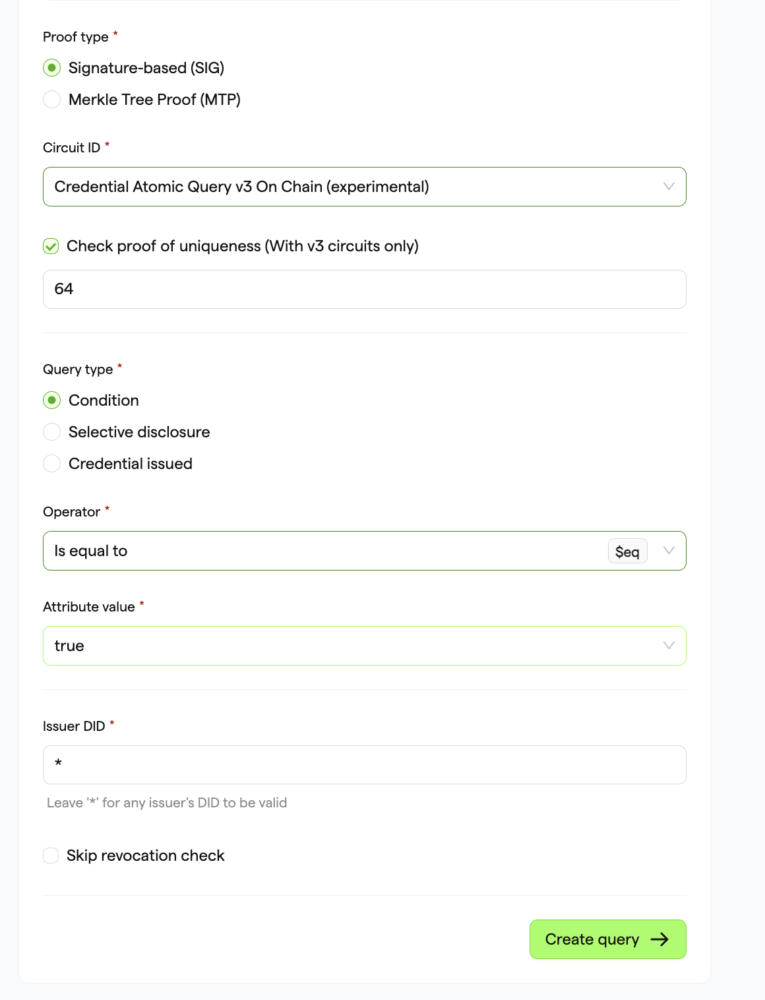
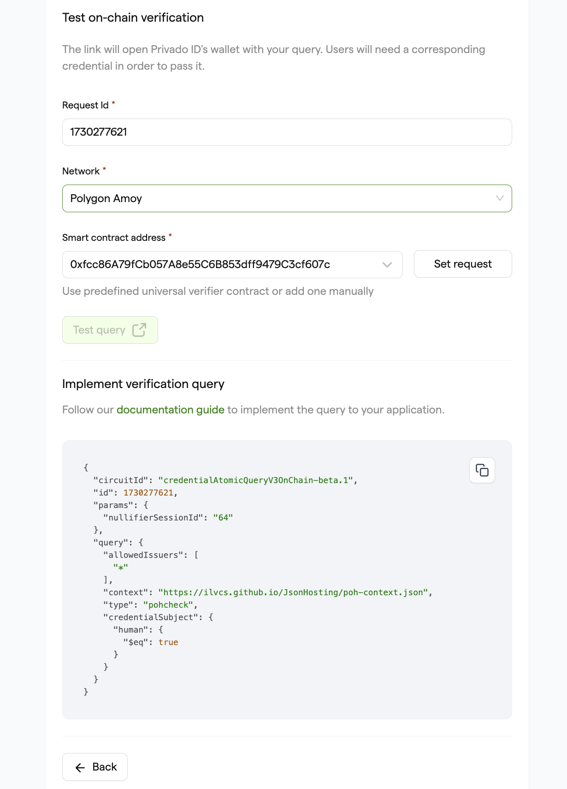
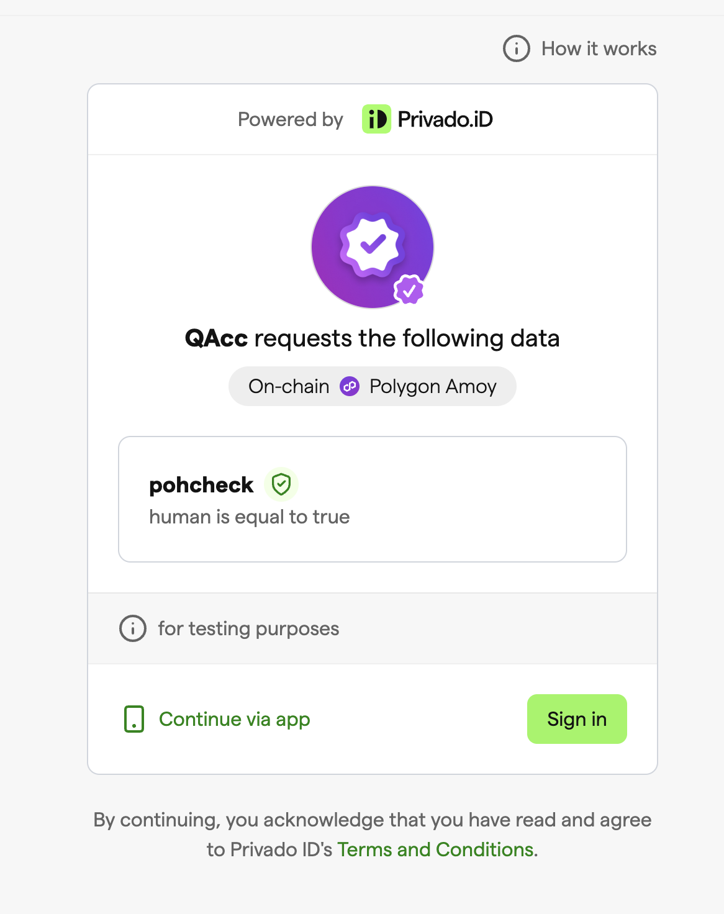

#Setting Up the Query Request

### Approach - A Setting Request using Query Builder:

1. Visit the [PrivadoID Query Builder](https://tools.privado.id/query-builder) and paste the JSON-LD Context URL (mentioned above) in the input box.
2. Select the schema type to `pohcheck` and select the `human` in the Attribute field.

3. Select the Proof type "Signature-based (SIG)" and Circuit ID Credential Atomic Query v3 On Chain.

4. Set the query type as Condition and Operator as "Is equal to," and select `true` in the Attribute value.

5. Set the Issuer DID field to "*" to accept credentials from any issuer or, if you want, you can use any specific DID to restrict allowed issuers for the query.

6. Next, click on the **“Create query”**.

7. Add the Universal Verifier Smart contract address for the selected network (e.g., for Polygon Amoy: `0xfcc86A79fCb057A8e55C6B853dff9479C3cf607c`) in the Smart Contract Address input.

8. Click on the **Set request** to submit the on-chain request.

9. Click on **Confirm** in the Metamask to accept and submit the request.

   **NOTE:** Make sure you have sufficient Gas tokens (e.g., MATIC in the Polygon network) in your wallet to submit the transaction.

10. Once the transaction is successful, you can click on the **Test Query** button to easily create the query request, where you will be presented with a QR code that can be scanned by users to generate the proof or copy the URL and use it for verification with the web wallet.

**NOTE:** You only need to set the request once (per query), and it can be used by all users to scan, generate, and submit the proof to the smart contract via the Privado ID Mobile Wallet app or Privado ID Web Wallet. 

   **Note:** Make sure you note down the **Request ID** as it is used in the Logic smart contract.

### Approach - B Setting Request Programmatically:

We provide a deployment script that you can use as a starting point to set up your own query. To get started, follow these steps:

1. Clone the XYZ Protocol contracts repository using Git:  
   `git clone https://github.com/iden3/contracts.git`

2. Navigate into the cloned repository:  
   `cd contracts`

3. Add your Private Key and JSON RPC URL strings for the desired blockchain network (e.g., Polygon Amoy). This will allow you to deploy the query on your chosen chain.

4. Configure the `hardhat.config` file according to your preferences.

5. Next, replace the placeholders in the script with your own query values. For this example, we'll use a PoH query:  
   `npx hardhat run scripts/maintenance/setProofRequest.ts --network amoy`

This command will set up the airdrop request and print out the query used for convenience. You can then create a QR code using this query, which can be scanned by users with Privado ID mobile to verify their credentials.

