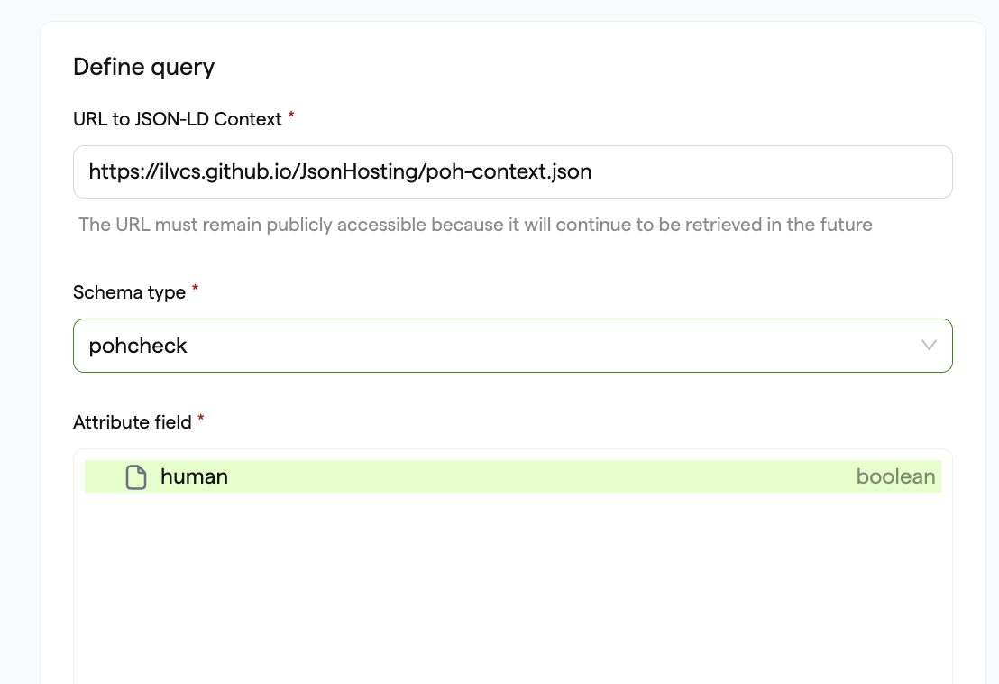
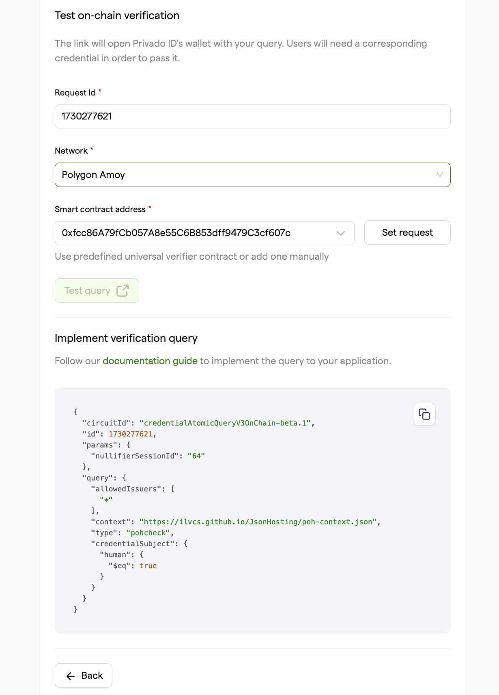
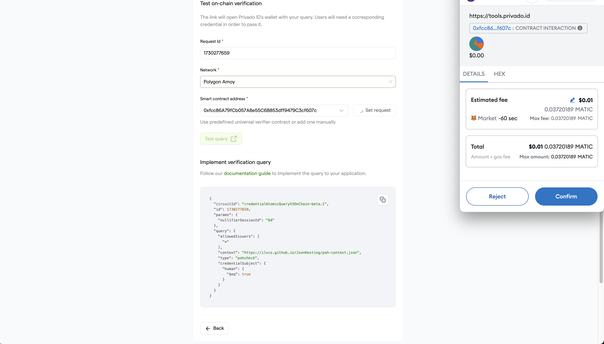
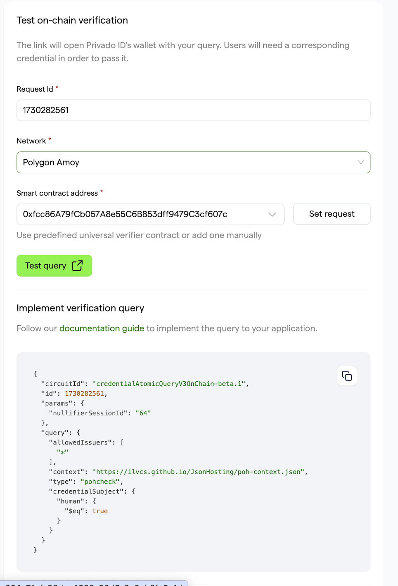
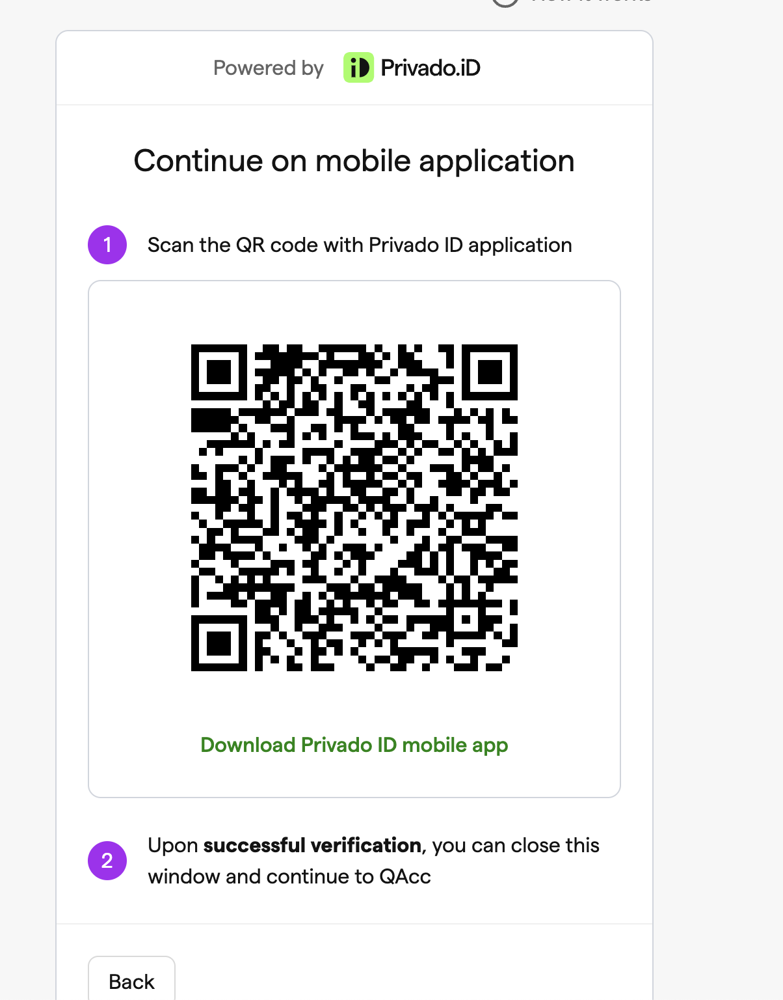

# ZK Airdrop: A Secure Cross-Chain Token Distribution Tutorial

## Introduction

Imagine a scenario where a new "XYZ Protocol" is launching and wants to distribute tokens to users via an airdrop. However, to ensure the quality and compliance of the distribution, XYZ Protocol wants to restrict participation to users who have Proof of Humanity (PoH) Credential to restrict bots from participating in the airdrop. This airdrop will be conducted using cross-chain verification, allowing users from different blockchain networks to participate securely.

## Key Requirements for the Airdrop:

- **PoH Credential Verification**: Users must possess PoH credentials.
- **Cross-Chain Participation**: Users can prove their eligibility from different chains, such as Ethereum, Polygon, etc.
- **Privacy Preservation**: Use zero-knowledge proofs to maintain user privacy while verifying credentials.

### Components Involved:

- **User Chain**: The chain where users hold their identity and credentials.
- **Issuer Chain**: The chain where issuers manage and verify credential validity.
- **Verification Chain**: The chain where the airdrop verification occurs.
- **Universal Verifier**: A smart contract on verification chain that handles the verification of ZK proofs and the issuance of airdrop tokens.

## Step 1: Setting Up the Query Request

The first step in using XYZ Protocol is to set up an airdrop request that specifies the verification criteria. This criteria can be customized to fit your needs, but for this example, we'll demonstrate how to check if a user has a Proof Of Humanity (PoH) credential and verify their isHuman value.

**NOTE:** Schema URLs used for this tutorial:  
- `"jsonLdContext": "https://ilvcs.github.io/JsonHosting/poh-context.json"`  
- `"jsonSchema": "https://ilvcs.github.io/JsonHosting/poh-json-schema.json"`

### Approach - A Setting Request using Query Builder:

1. Go to the **PrivadoID Query Builder** and paste the JSON-LD Context URL (mentioned above) in the input box.
2. Select the schema type to `pohcheck` and select the `human` in the Attribute field.

3. Select the Proof type "Signature-based (SIG)" and Circuit ID Credential Atomic Query v3 On Chain.

4. Set the query type as Condition and Operator as "Is equal to," and select `true` in the Attribute value.

5. Set the Issuer DID field to "*" to accept credentials from any issuer or, if you want, you can use any specific DID to restrict allowed issuers for the query.


6. Next, click on the **“Create query”**.

7. Add the Universal Verifier Smart contract address for the selected network (e.g., for Polygon Amoy: `0xfcc86A79fCb057A8e55C6B853dff9479C3cf607c`) in the Smart Contract Address input.


8. Click on the **Set request** to submit the on-chain request.

9. Click on **Confirm** in the Metamask to accept and submit the request.


   **NOTE:** Make sure you have sufficient Gas tokens (e.g., MATIC in the Polygon network) in your wallet to submit the transaction.

10. Once the transaction is successful, you can click on the **Test Query** button to easily create the query request, where you will be presented with a QR code that can be scanned by users to generate the proof or copy the URL and use it for verification with the web wallet.




**NOTE:** You only need to set the request once (per query), and it can be used by all users to scan, generate, and submit the proof to the smart contract via the Privado ID Mobile Wallet app or Privado ID Web Wallet. 

   **Note:** Make sure you note down the **Request ID** as it is used in the Logic smart contract.

### Approach - B Setting Request Programmatically:

We provide a deployment script that you can use as a starting point to set up your own query. To get started, follow these steps:

1. Clone the XYZ Protocol contracts repository using Git:  
   `git clone https://github.com/0xPolygonID/contracts.git`

2. Navigate into the cloned repository:  
   `cd contracts`

3. Add your Private Key and JSON RPC URL strings for the desired blockchain network (e.g., Polygon Amoy). This will allow you to deploy the query on your chosen chain.

4. Configure the `hardhat.config` file according to your preferences.

5. Next, replace the placeholders in the script with your own query values. For this example, we'll use a PoH query:  
   `npx hardhat run scripts/setProofRequest.ts --network amoy`

This command will set up the airdrop request and print out the query used for convenience. You can then create a QR code using this query, which can be scanned by users with Privado ID mobile to verify their credentials.

## Step 2: Creating Secure Airdrop System

### A. Implementing Airdrop Smart Contract:

Now we need to create an Airdrop smart contract that can check if the user has already presented proofs to the Universal Verifier (and has been verified). If so, mint tokens for the user. 

Clone the repo, add your private key and JSON RPC URL for Amoy in your `.env` file as specified in the sample.env file. Check the `ZKAirdroverifer.sol` smart contract in the contracts directory that looks like this: 

```solidity
// SPDX-License-Identifier: MIT
pragma solidity 0.8.20;

import {ERC20} from '@openzeppelin/contracts/token/ERC20/ERC20.sol';
import {PrimitiveTypeUtils} from '@iden3/contracts/lib/PrimitiveTypeUtils.sol';
import {ICircuitValidator} from '@iden3/contracts/interfaces/ICircuitValidator.sol';
import {UniversalVerifier} from '@iden3/contracts/verifiers/UniversalVerifier.sol';

contract ZKAirdropVerifier is ERC20 {
  uint64 public constant REQUEST_ID = 12345; // replace with your request ID

  UniversalVerifier public verifier;

  uint256 public TOKEN_AMOUNT_FOR_AIRDROP_PER_ID = 5 * 10 ** uint256(decimals());

  mapping(address => bool) public isClaimed;

  modifier beforeTokenTransfer(address to) {
     // only one airdrop per address is allowed
     require(
        !isClaimed[to],
        'only one airdrop per address is allowed'
     );

     require(
        verifier.getProofStatus(to, REQUEST_ID).isVerified ,
        'only identities who provided sig or mtp proof for transfer requests are allowed to receive tokens'
     );
     _;
  }

  constructor(
     UniversalVerifier verifier_,
     string memory name_,
     string memory symbol_
  ) ERC20(name_, symbol_) {
     verifier = verifier_;
  }

  function mint() public {
     
     require(msg.sender == tx.origin, 'only EOA can mint');
     require(msg.sender != address(0), 'invalid address');
     _mint(msg.sender, TOKEN_AMOUNT_FOR_AIRDROP_PER_ID);
     // mark the address as claimed
     isClaimed[msg.sender] = true;
  }

  function _update(
     address from,
     address to,
     uint256 value
  ) internal override beforeTokenTransfer(to) {
     super._update(from, to, value);
  }
}
```

You can see that the smart contract's construction requires the address of the deployed Universal Verifier smart contract.

Make sure to add the request ID used to set the `ZKPRequest` for the `uint64 public constant REQUEST_ID`.

The `beforeTokenTransfer` modifier checks the Universal Verifier smart contract to see if the user has been verified and if they have already claimed the airdrop.

We override the `_update` function to use the `beforeTokenTransfer` modifier, ensuring that every time a user calls the `mint` function, it will trigger this check. The contract verifies that the user has submitted the necessary proofs and is verified before allowing token minting. Once the tokens are minted, the `mint` function sets the `isClaimed` status to `true` to prevent users from reclaiming the airdrop.

In summary, when a user calls the `mint` function, the smart contract checks if the user has been verified (submitted proofs and got verified by Universal Verifier). If verified, it mints 5 tokens for the user.

**Note:** You can observe that you don't need to implement the Universal Verifier smart contract yourself. Instead, you only need the address of the deployed Universal Verifier smart contract to use in your custom smart contract implementation.

### B. Deploy the Smart Contract:

Run the deploy command after installing dependencies with `npm i`. Note down the smart contract address for use in the claiming process.

`npx hardhat run scripts/deploy.js --network amoy`

## Step 3: User Claiming The Airdrop

### A. Obtaining and Signing the Verifiable Credential

Users need to obtain a `POH Credential`, which proves their Proof of Humanity (PoH). This credential can be issued by a trusted identity provider on the Issuer Chain.

On the Privado ID issuer node, credentials will be issued using the Privado chain, which acts like a base layer for issuing identities.

**Note:** Follow this tutorial to learn how to get a Proof of Humanity (PoH) credential from the Privado ID demo issuer.

### B. User Submitting Proof to Verification Chain

The user submits the ZK proof and signed data to the Universal Verifier smart contract on the verification chain. For this example, we are using Polygon Amoy to submit proof.

The Universal Verifier smart contract verifies the ZK proof and checks the signed GIST Root and issuer state data.

Once the user submits the proof and gets verified by the Universal Verifier, they can claim tokens by calling the `mint` function in the `ZKAirdropVerifier` smart contract.

### C. Claiming Airdrop

Once the user submits the proof and gets verified by the Universal Verifier, they can claim tokens by calling the `mint` function in the `ZKAirdropVerifier` smart contract.

**Note:** Use the same Ethereum wallet account that was used to submit proofs for claiming tokens. Ideally, protocol developers should create a website that connects with the `ZKAirdropVerifier` smart contract. However, for demonstration purposes, here is a Hardhat project with a script to claim tokens.


## Conclusion

In this tutorial, we have walked through the process of setting up a secure token distribution system using zero-knowledge proofs. By leveraging the Universal Verifier smart contract and the Privado ID platform, we ensure that only verified users with Proof of Humanity credentials can participate in the airdrop, thereby preventing bots and ensuring compliance.

This approach not only enhances the security and integrity of the airdrop but also preserves user privacy. By following the steps outlined, you can implement a similar system for your own token distribution needs, ensuring a fair and secure process for all participants.

Happy coding!

